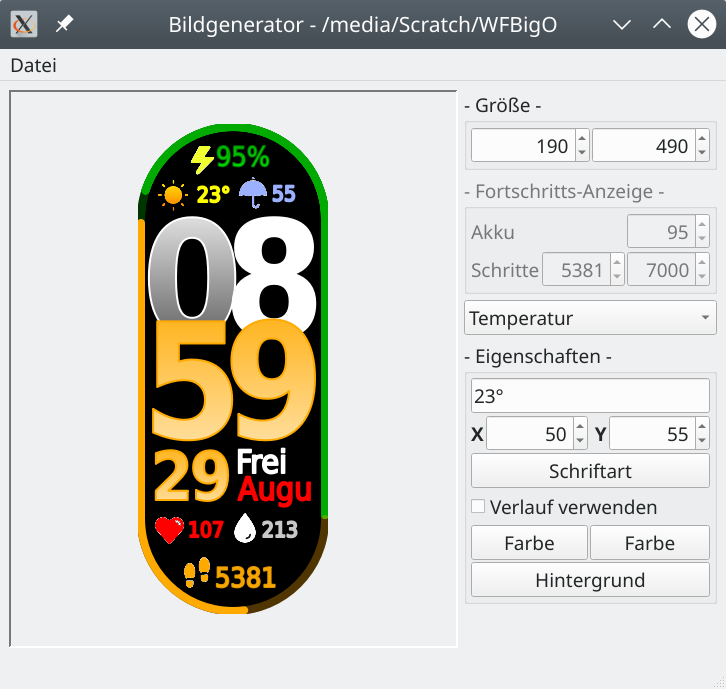

# Watchface_ImageCreator
application to assist in creation of all the needed images for a watchface

- to start, select "**new**" from main menu and select an (empty) directory
- use the **dropdown combobox** to select the element you want to edit
- change **x** and **y** coordinates to position your element
- using **font** and **color** buttons you can style your element
- when you're done, select "**save**" from main menu and select a directory where you want to put your images

- when reopening a project, select "**open**" from main menu and select the "*watchface-pre.txt*" file written at last save.
